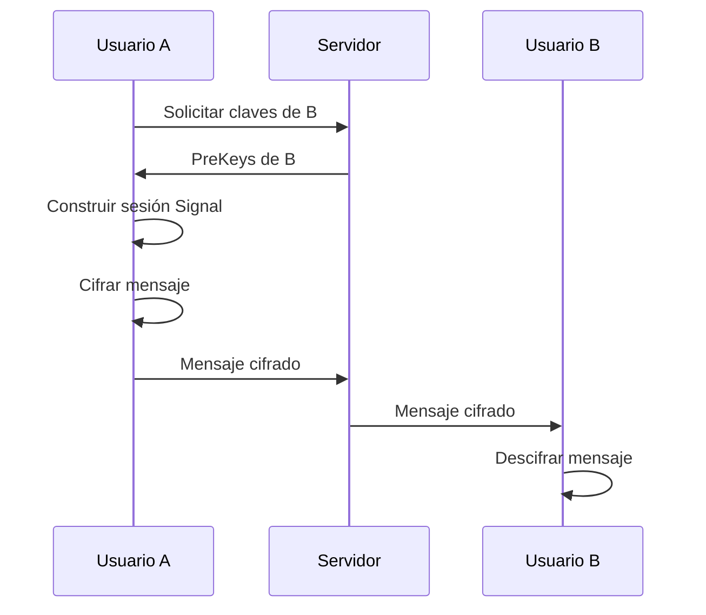

# Guía de Seguridad - Speack3

Esta guía explica cómo Speack3 implementa cifrado End-to-End (E2E) usando Signal Protocol y las mejores prácticas de seguridad.

## ¿Qué es el Cifrado End-to-End?

El cifrado End-to-End (E2E) significa que solo el remitente y el destinatario pueden leer los mensajes. Ni siquiera el servidor puede descifrarlos.

## Signal Protocol

Speack3 utiliza **Signal Protocol**, el mismo sistema de cifrado usado por:

- ✅ WhatsApp
- ✅ Signal Messenger
- ✅ Facebook Messenger (en modo secreto)

### Componentes Clave


#### 1. Identity Keys (Claves de Identidad)

Cada usuario tiene un par de claves únicas (pública/privada):

- **Clave Pública**: Se comparte con otros usuarios
- **Clave Privada**: NUNCA sale del dispositivo

#### 2. PreKeys

Claves de un solo uso para establecer sesiones seguras:

- Se generan en lotes (100 por usuario)
- Se consumen cuando alguien inicia una conversación
- Se regeneran automáticamente

#### 3. Signed PreKey

Una clave especial firmada con la clave de identidad para autenticación.

## Flujo de Cifrado

### Primera Conversación



1. **Usuario A** solicita las claves públicas de **Usuario B**
2. **Usuario A** construye una sesión Signal con las claves de B
3. **Usuario A** cifra el mensaje usando la sesión
4. El servidor solo ve datos cifrados (no puede leerlos)
5. **Usuario B** descifra el mensaje con su clave privada

### Mensajes Posteriores

Después del primer mensaje:

- Se usa "Double Ratchet Algorithm"
- Cada mensaje genera nuevas claves efímeras
- Proporciona "Forward Secrecy" (seguridad hacia adelante)

## Forward Secrecy

Incluso si alguien roba tu clave privada HOY, no puede descifrar mensajes del PASADO.

Cada mensaje usa claves temporales que se eliminan después de usar.

## Almacenamiento de Claves

### En el Dispositivo (Móvil)

| Dato                | Almacenamiento              | Seguridad                  |
|---------------------|----------------------------|----------------------------|
| Clave Privada       | iOS Keychain / Android Keystore | ✅ Cifrado por hardware  |
| Mensajes (cache)    | AsyncStorage               | ⚠️ Cache temporal          |
| Token de sesión     | AsyncStorage               | ⚠️ Expira en 1 hora        |

### En el Servidor

| Dato                | Almacenamiento | ¿Visible? |
|---------------------|---------------|-----------|
| Clave Pública       | MongoDB       | ✅ Sí     |
| PreKeys             | MongoDB       | ✅ Sí     |
| Mensajes cifrados   | MongoDB       | ❌ No (cifrados) |
| Passwords           | MongoDB       | ❌ No (hasheados con bcrypt) |

> ⚠️ **IMPORTANTE**: El servidor NUNCA tiene acceso a claves privadas ni mensajes sin cifrar.

## Seguridad de Transporte

### HTTPS/WSS (Producción)

Para producción, SIEMPRE usa:

- ✅ **HTTPS** para API REST
- ✅ **WSS** (WebSocket Secure) para mensajes en tiempo real
- ✅ Certificados SSL/TLS válidos

### Por qué HTTP no es suficiente

Aunque los mensajes están cifrados E2E, sin HTTPS:

- ❌ Metadata visible (quién habla con quién, cuándo)
- ❌ Vulnerable a ataques Man-in-the-Middle
- ❌ Tokens de sesión podrían ser interceptados

## Autenticación

### JWT (JSON Web Tokens)

Speack3 usa JWT para autenticación:

1. **Access Token**: Expira en 1 hora
2. **Refresh Token**: Expira en 7 días

### Mejores Prácticas

```javascript
// ✅ CORRECTO: Token en header
Authorization: Bearer eyJhbGc...

// ❌ INCORRECTO: Token en URL
GET /api/users?token=eyJhbGc...
```

## Seguridad de Passwords

### Hashing con bcrypt

```javascript
// En el servidor (NO en el cliente)
const hashedPassword = await bcrypt.hash(password, 10);
```

- 10 rondas de salt
- Computacionalmente costoso (previene ataques de fuerza bruta)
- Contraseñas NUNCA se almacenan en texto plano

### Requisitos de Password

- ✅ Mínimo 6 caracteres (recomendado: 12+)
- ✅ Validación en cliente Y servidor
- ⚠️ Considera añadir requisitos: mayúsculas, números, símbolos

## Grupos Cifrados

### Implementación Actual (Simplificada)

La versión actual usa un enfoque simplificado para grupos:

- Mensajes se cifran con información del sender
- Todos los miembros pueden descifrar

### Mejora Recomendada: Sender Keys

Para grupos grandes, implementar [Sender Keys Protocol](https://signal.org/docs/specifications/doubleratchet/#sender-keys):

```
Emisor → Genera clave grupal → Distribuye a miembros
Miembro1 ← Cifrado con clave grupal ← Mensaje
Miembro2 ← Cifrado con clave grupal ← Mensaje
...
```

Ventajas:

- ✅ Más eficiente en grupos grandes
- ✅ Mismo nivel de seguridad
- ✅ Menos overhead

## Vulnerabilidades Comunes

### ❌ NO Hacer

```javascript
// Malo: Almacenar clave privada en texto plano
localStorage.setItem('privateKey', key);

// Malo: Enviar mensaje sin cifrar
socket.emit('message', { text: 'Hola' });

// Malo: Hardcodear secretos
const JWT_SECRET = 'abc123';
```

### ✅ Hacer

```javascript
// Bueno: Usar almacenamiento seguro
Keychain.setGenericPassword('key', encryptedKey);

// Bueno: Cifrar antes de enviar
const encrypted = await signalService.encrypt(message);
socket.emit('message', { encrypted });

// Bueno: Variables de entorno
const JWT_SECRET = process.env.JWT_SECRET;
```

## Auditoría de Seguridad

### Checklist para Producción

- [ ] HTTPS/WSS configurado correctamente
- [ ] Certificados SSL válidos
- [ ] JWT secrets cambiados (no usar valores de ejemplo)
- [ ] Firewall configurado correctamente
- [ ] MongoDB autenticación habilitada
- [ ] Backups cifrados
- [ ] Logs no contienen información sensible
- [ ] Rate limiting implementado
- [ ] CORS configurado correctamente

### Herramientas de Auditoría

```bash
# Escanear vulnerabilidades en dependencias
npm audit

# Fix automático
npm audit fix

# Análisis de seguridad
npm install -g snyk
snyk test
```

## Limitaciones Conocidas

### ⚠️ Metadata No Cifrada

Aunque los mensajes están cifrados, la metadata es visible para el servidor:

- Quién envía a quién
- Cuándo se envían mensajes
- Tamaño aproximado de mensajes
- Patrones de comunicación

**Solución**: En futuras versiones, considerar:

- Sealed sender (remitente sellado)
- Traffic padding (relleno de tráfico)
- Timing obfuscation (ofuscación de timing)

### ⚠️ Confianza en el Código Cliente

Los usuarios deben confiar que la app no tiene backdoors.

**Mitigación**:

- Código abierto (permitir auditoría)
- Builds reproducibles
- Code signing

## Mejores Prácticas para Usuarios

1. **Verificar Claves de Seguridad**
   - En producción, implementar verificación de safety numbers
   - Los usuarios deben poder comparar fingerprints

2. **Bloqueos de Pantalla**
   - Usar PIN/biometría en el dispositivo
   - La app no puede proteger contra dispositivos desbloqueados

3. **Actualizaciones**
   - Mantener la app actualizada
   - Parches de seguridad regulares

## Respuesta a Incidentes

### Si se Compromete el Servidor

1. Las claves privadas están SEGURAS (solo en dispositivos)
2. Mensajes antiguos son seguros (Forward Secrecy)
3. Regenerar JWT secrets
4. Forzar re-login de todos los usuarios

### Si se Compromete un Dispositivo

1. Mensajes en ese dispositivo están comprometidos
2. Mensajes futuros con otros dispositivos siguen seguros
3. Usuario debe:
   - Cambiar password
   - Regenerar claves (logout/login)

## Recursos Adicionales

- [Signal Protocol Specification](https://signal.org/docs/)
- [OWASP Mobile Security](https://owasp.org/www-project-mobile-security/)
- [React Native Security Guide](https://reactnative.dev/docs/security)

## Contacto de Seguridad

Para reportar vulnerabilidades:

- 📧 Crea un issue en GitHub (para vulnerabilidades)
- 🔒 Usa comunicación cifrada para issues críticos

---

**Último Update**: 2025-12-12  
**Versión**: 1.0.0
